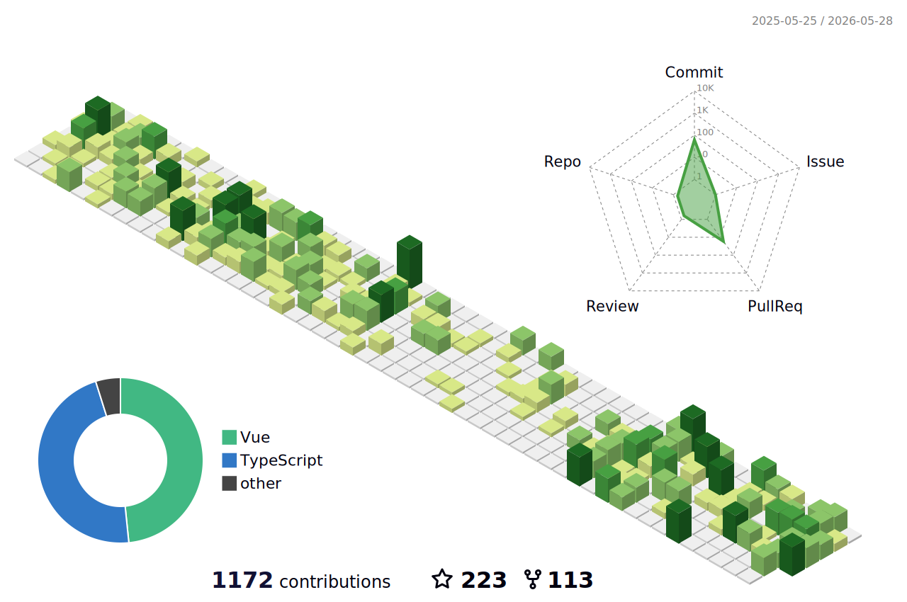

<!-- 
[][website]  
-->

  

 

 

### :studio_microphone:  Podcast DOUBLE SLASH [//.][podcast]
<!-- BLOG-POST-LIST:START -->
- [News Juillet 2026, TypeScript 7 RC, Astro 7 et des pièges pour agents IA](https://double-slash.dev/podcasts/news-jul26/)
- [News Juin 2026 RC2, React quitte Meta, VoidZero rejoint Cloudflare et IA locale](https://double-slash.dev/podcasts/news-juin26-rc2/)
- [News Juin 2026, Bun passe à Rust, npm verrouille les scripts et SEO pour l&#39;IA](https://double-slash.dev/podcasts/news-jun26/)
- [Comment faire tourner une IA en local: outils, modèles et configuration matérielle](https://double-slash.dev/podcasts/ia-local/)
- [News Mai 2026, TypeScript 7 en beta, faux package TanStack et agent Cursor destructeur](https://double-slash.dev/podcasts/news-mai26/)
<!-- BLOG-POST-LIST:END -->

--- 
<!--

-->
<!--  -->

[website]:https://www.alexduval.fr/?utm_campaign=ReadMe&utm_medium=img&utm_source=Github
[podcast]:https://bit.ly/3hcwGTq
