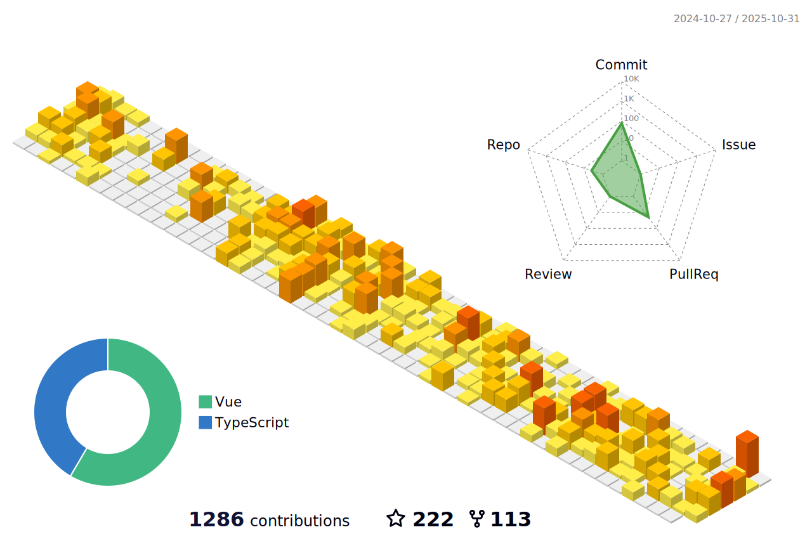

<!-- 
[][website]  
-->

 

 
 
  

 

 

<!-- 

-->

### :studio_microphone:  Podcast DOUBLE SLASH [//.][podcast]
<!-- BLOG-POST-LIST:START -->
- [Les news web dev pour avril 2025](https://double-slash.dev/podcasts/news-avril-25/)
- [Développer des projets IA - Comprendre les RAG](https://double-slash.dev/podcasts/ia-rag/)
- [Les news web dev pour mars 2025 RC2](https://double-slash.dev/podcasts/news-mars-rc2/)
- [Les news web dev pour mars 2025](https://double-slash.dev/podcasts/news-mar-25/)
- [Les news web dev pour février 2025](https://double-slash.dev/podcasts/news-feb25/)
<!-- BLOG-POST-LIST:END -->

--- 
<!--

-->
<!--  -->

[website]:https://www.alexduval.fr/?utm_campaign=ReadMe&utm_medium=img&utm_source=Github
[podcast]:https://bit.ly/3hcwGTq
